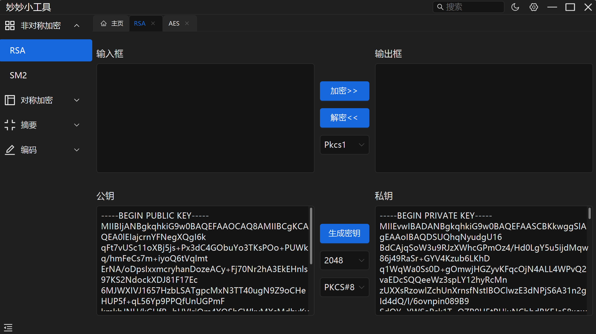
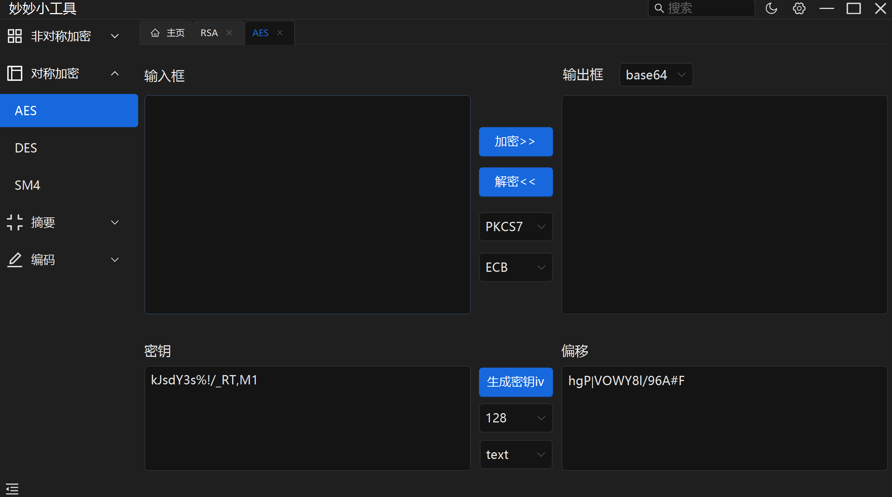
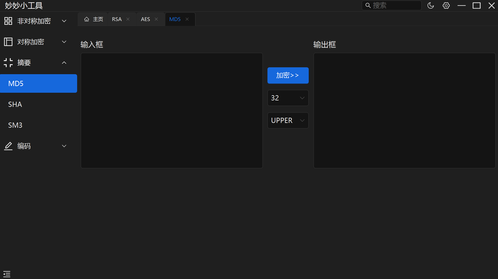
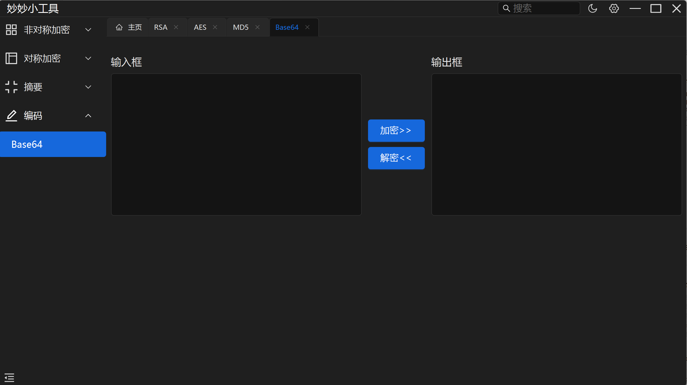

# 妙妙小工具 LittleFancyTool

# 加密模块

## 一、简介

本工具加密模块是一款基于 Windows Forms 开发的桌面应用程序，旨在为用户提供多种加密算法，以保障数据的安全性。支持常见的加密算法如 RSA、SM2、AES、DES、SM4、MD5、SHA、SM3、Base64 等，方便用户根据不同需求对数据进行加密和解密操作。

## 二、功能特点

1. 多算法支持：
   - **RSA**：一种非对称加密算法，可生成密钥对，公钥用于加密，私钥用于解密，支持多种密钥长度（如 512、1024、2048、4096 位）和填充方式（如 Pkcs1、OaepSHA1、OaepSHA256 等），适用于数字签名、密钥交换等场景。
   - **SM2**：我国自主设计的非对称加密算法，能生成密钥对，公钥加密、私钥解密。密钥长度通常 256 位，有 C1C3C2、C1C2C3 加密模式，用于数字签名、密钥交换、加密，安全高效。
   - **AES**：对称加密算法，加密和解密速度快，使用相同密钥，支持不同的填充方式（如 PKCS7、None、Zeros），常用于对大量数据的加密。
   - **DES**：对称加密算法，密钥长度 64 位（实际有效 56 位），使用 64 位初始化向量，可实现数据加密解密，不过由于密钥长度较短，安全性相对较低。
   - **SM4**：国产对称加密算法，属于国密算法体系，密钥和初始化向量均为 128 位，具有较高安全性，支持生成随机密钥和向量，加密后数据以 Base64 字符串输出。
   - **MD5**：一种广泛使用的哈希算法，能将任意长度数据转换为固定 128 位哈希值。但存在安全漏洞，易被碰撞攻击，常用于数据完整性校验场景。
   - **SHA**：安全哈希算法家族，包含多个成员如 SHA - 1、SHA - 2（含 SHA - 256、 SHA - 384、SHA - 512 等）。能生成不同长度哈希值，SHA - 1 有安全隐患，SHA - 2 仍广泛用于数字签名、数据完整性验证等。
   - **SM3**：我国自主设计的密码哈希算法，可把任意长度数据转换为 256 位哈希值，具备高安全性和抗碰撞性，用于数字签名、认证等信息安全领域。
   - **Base64**：一种编码方式，虽不是严格意义上的加密算法，但可对数据进行简单的可逆转换，常用于数据传输过程中的编码。
2. 密钥管理：
   - 对于 RSA 算法，可在软件界面生成密钥对，公钥和私钥以 PEM 文本格式呈现，方便用户保存和使用。同时，在加密和解密时能确保使用对应的密钥对。
   - 其他对称加密算法如 AES、DES、SM4，可根据用户需求生成随机密钥和初始化向量，密钥和向量也能以合适的字符串格式（如十六进制字符串）展示，便于记录与后续使用。
3. 界面交互：
   - 采用Antdui控件设计界面，通过菜单栏可轻松切换不同加密算法的操作界面，每个界面针对相应算法的特点布局了输入框、输出框、密钥框、加解密按钮以及相关参数设置下拉框（如密钥长度、填充方式）等控件，方便用户操作。
   - 界面具备自适应能力和自动dpi缩放。

## 三、需求

- .net 8.0

## 四、示例

